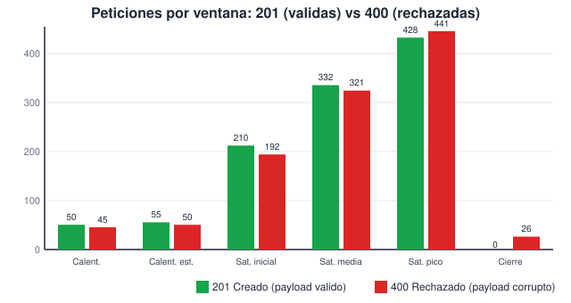
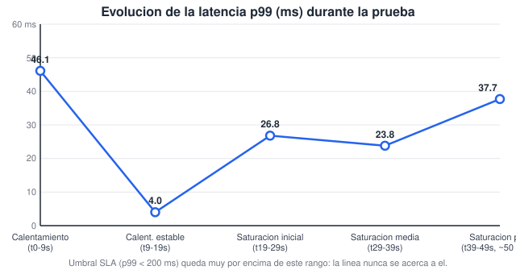

# Informe técnico: Análisis de estrés con Artillery (p99 y rendimiento colectivo)

## Datos informativos

- **Asignatura:** Patrones de Diseño de APIs
- **Unidad:** Unidad 2
- **Proyecto:** API REST para la gestión de empleados
- **Estudiante:** Pablo Jara

## 1. Escenario de prueba

Se ejecutó `artillery run stress-test.yml` contra `http://localhost:3000` con dos fases:

| Fase | Duración | Tasa de arribo | Descripción |
|---|---|---|---|
| 1. Calentamiento | 20 s | 5 req/s constante | Tráfico base para estabilizar el pool de conexiones a MongoDB y el JIT de V8 |
| 2. Saturación máxima | 30 s | 15 → 50 req/s (rampa) | Pico de carga transaccional |

Cada iteración de usuario virtual ejecuta dos peticiones `POST /api/v1/employees`:

- **Flujo A (payload correcto):** empleado válido según el DTO Zod → se espera `201`.
- **Flujo B (payload corrupto):** `sueldo: -500` y `nombre: "Al"` (menor al mínimo de 3 caracteres) → se espera `400`.

Umbrales (`ensure.thresholds`) definidos: `p99 < 200 ms` y `maxErrorRate < 1%`.

## 2. Resultado consolidado (reporte de consola)

```
http.codes.201: ................................................................ 1075
http.codes.400: ................................................................ 1075
http.requests: .................................................................. 2150
http.response_time:
  p95: ......................................................................... 12.1
  p99: ......................................................................... 37.7
http.response_time.2xx:
  p99: ......................................................................... 57.4
http.response_time.4xx:
  p99: ......................................................................... 3
vusers.failed: .................................................................. 0

Checks:
ok: maxErrorRate < 1
ok: http.response_time.p99 < 200
```

## 3. ¿`201` vs `400` cuadran con el tráfico inyectado?

**Sí, exactamente.** El escenario manda 1 payload válido y 1 corrupto por cada usuario virtual (relación 1:1).

| Métrica | Valor |
|---|---|
| `http.codes.201` (aceptados) | 1075 |
| `http.codes.400` (rechazados) | 1075 |
| `vusers.failed` | 0 |

Los 1075 rechazos coinciden al 100% con los 1075 payloads corruptos enviados: **cero falsos positivos y cero falsos negativos**, incluso con la tasa de arribo subiendo hasta 50 req/s.



*La gráfica muestra que las barras verdes (201) y rojas (400) crecen juntas y en proporción similar en cada ventana de tiempo — la validación de Zod no pierde precisión bajo carga.*

**Conclusión (ISO/IEC 25010 — Corrección Funcional):** el filtro de datos inválidos funciona de forma determinista sin importar la concurrencia, lo cual es evidencia directa de esa sub-característica.

## 4. ¿Cómo se comportó el p99 durante la saturación?

| Ventana | req/s aprox. | p99 (ms) |
|---|---|---|
| Calentamiento (t0–9s) | 10 | 46.1 |
| Calentamiento estable (t9–19s) | 10 | 4.0 |
| Saturación inicial (t19–29s) | 42 | 26.8 |
| Saturación media (t29–39s) | 68 | 23.8 |
| Saturación pico (t39–49s, ~50 req/s) | 88 | 37.7 |
| **Total del run** | — | **37.7** |



**En una frase: el crecimiento es leve y controlado, no exponencial.** Hay un pico inicial (46.1 ms) por el arranque en frío — primera conexión a MongoDB y compilación JIT — luego la latencia baja a 4 ms, y durante la rampa de carga sube de forma gradual hasta 37.7 ms. Todo esto queda **muy por debajo** del umbral de 200 ms.

**¿Por qué sube un poco al final, si no es un problema grave?** Porque cuatro tareas se ejecutan de forma **síncrona** en el único hilo de Node.js antes de cada respuesta, y compiten entre sí cuando llegan muchas peticiones a la vez:

1. **Validación con Zod** (`safeParse`) — se ejecuta en el hilo principal en cada request.
2. **Parseo/serialización JSON** del body y de la respuesta (`sendSuccess`).
3. **Casting de Mongoose** (tipos y validadores del esquema) antes de guardar en MongoDB.
4. **Logging con Morgan** — escribir a la consola también puede bloquear brevemente.

Como Node.js no usa varios hilos por defecto (sin `cluster`/`worker_threads`), todo ese trabajo se hace uno tras otro. Con 50 req/s no alcanza a saturar el Event Loop, pero si la carga siguiera subiendo, estas 4 tareas serían las primeras responsables de que el p99 se dispare.

**Conclusión (ISO/IEC 25010 — Eficiencia de Desempeño):** el sistema cumple el SLA con margen amplio (37.7 ms de 200 ms), pero la tendencia ascendente del p99 es una señal temprana a vigilar si el tráfico esperado supera los 50 req/s.

## 5. Conclusión general

- ✅ Ambos umbrales se cumplieron: `p99 < 200 ms` y `maxErrorRate < 1%`.
- ✅ Corrección funcional perfecta: 1075/1075 rechazos correctos.
- ⚠️ El p99 crece de forma acotada bajo carga; el cuello de botella futuro más probable es el trabajo síncrono (Zod, JSON, Mongoose, logging) compitiendo por el único hilo de Node.js.
- 💡 Recomendación: si el tráfico esperado en producción supera los 50 req/s, evaluar `cluster` o `worker_threads` para repartir ese trabajo síncrono entre varios núcleos.

## 6. Análisis complementario y recomendaciones

### Lectura de los resultados

- En Artillery, `arrivalRate` representa usuarios virtuales por segundo, no solicitudes por segundo. Con esta configuración se programan aproximadamente 1075 usuarios virtuales: 100 en el calentamiento y 975 durante la rampa. Cada usuario ejecuta dos peticiones, por lo que el total esperado es 2150 solicitudes. Conviene corregir esa unidad en la descripción de las fases y distinguirla de la tasa real observada.
- Los totales de 1075 respuestas `201` y 1075 respuestas `400` coinciden con los dos payloads de cada iteración. Sin aserciones explícitas de estado y contenido en cada paso, esta coincidencia no demuestra por sí sola que cada payload recibió la respuesta correcta; tampoco permite concluir que hubo cero falsos positivos o negativos.
- El p99 global fue 37.7 ms, mientras que el p99 de las respuestas `2xx` fue 57.4 ms. Como las respuestas `4xx` son mucho más rápidas (p99 de 3 ms), el resultado global puede ocultar parte de la latencia de las creaciones válidas. Ambos valores están por debajo de 200 ms, pero es recomendable fijar y reportar también un umbral para `http.response_time.2xx.p99`.
- La prueba usa un 50% de payloads inválidos que la API rechaza durante la validación. Por tanto, solo la mitad de las solicitudes intenta escribir en MongoDB; estos resultados no representan por sí solos una prueba de carga completa de la base de datos. Además, al ejecutarse contra `localhost`, no miden la latencia de red hasta Atlas.
- El aumento observado del p99 no identifica por sí mismo el cuello de botella. Antes de atribuirlo al Event Loop, a Mongoose o a Atlas, conviene medirlos durante la prueba.

### Recomendaciones para MongoDB Atlas

1. Ejecutar el backend y el generador de carga en una región cercana a la del clúster Atlas, y probar contra Atlas desde un entorno de red comparable al de producción. Así se evita confundir latencia de red con latencia de la aplicación o de la base de datos.
2. Mantener una conexión Mongoose reutilizable durante toda la vida del proceso, establecida al iniciar el servicio, sin conectar y desconectar por petición. Ajustar `maxPoolSize` y, si hace falta, `minPoolSize` solo después de revisar conexiones, espera del pool y límites del clúster en las métricas de Atlas; un pool más grande no siempre mejora el rendimiento.
3. Crear un escenario adicional con operaciones válidas y una mezcla representativa de lecturas y escrituras para medir la carga real que llega a Atlas. Incluir también el escenario mixto actual para medir la validación y el comportamiento de la API.
4. Medir en paralelo p95/p99, errores y latencia de MongoDB, conexiones y CPU del clúster, además de CPU y retraso del Event Loop del backend. Los gráficos de supervisión de Atlas ayudan a distinguir saturación de base de datos, espera de conexiones y latencia de red.
5. Para consultas de listado con muchos empleados, aplicar paginación y seleccionar solo los campos necesarios; agregar índices únicamente para filtros u ordenamientos que realmente use la API. El repositorio ya usa `lean()` en varias lecturas, lo que evita instanciar documentos Mongoose cuando solo se necesitan objetos de datos.

### Guion breve para la presentación

“La prueba completó 2150 solicitudes y el p99 global fue de 37.7 milisegundos, por debajo del objetivo de 200 milisegundos. La proporción de respuestas `201` y `400` coincide con los payloads enviados, aunque agregaremos aserciones por petición para confirmar cada resultado. La carga de Artillery está expresada en usuarios virtuales por segundo, y la mitad de las peticiones inválidas se rechaza antes de llegar a MongoDB; por eso haremos una prueba adicional con operaciones válidas contra Atlas. Para optimizar Atlas, mediremos la latencia de red y de base de datos, mantendremos el pool de conexiones reutilizable y ajustaremos su tamaño según las métricas, no por suposición.”
